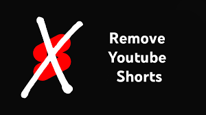

A [uBlock Origin](https://github.com/gorhill/uBlock) filter list that hides YouTube Shorts content — perfect for anyone tired of short-form video clutter.
IT removes all traces of YouTube shorts distractions in Feed and videos. This filter list also works with other content blockers.

# 𓊍 STEPS
1. uBlock Origin
2. Open the Dashboard
3. Filter Lists
4. 'Import...'
5. Paste this link below
- `https://raw.githubusercontent.com/tz-shuhag/block-shorts/refs/heads/main/block%20shorts.txt`
6. Click Apply Changes

## 🪄 Features

* Automatically hides YouTube Shorts videos on desktop and mobile.
* Filters Shorts from:
  * Home feed
  * Search results
  * Video suggestions
  * Channel pages & Shorts shelf
* Lightweight — minimal performance footprint.

## 📈 Contributing

Contributions are welcome!
* 🛠 Report bugs or request features via [Issues](https://github.com/tz-shuhag/block-shorts/issues/new/choose)

## 🏆 Credits

Made with ♡ by •󠁏󠁏 [TZ Shuhag](https://tz-shuhag.github.io)
---
